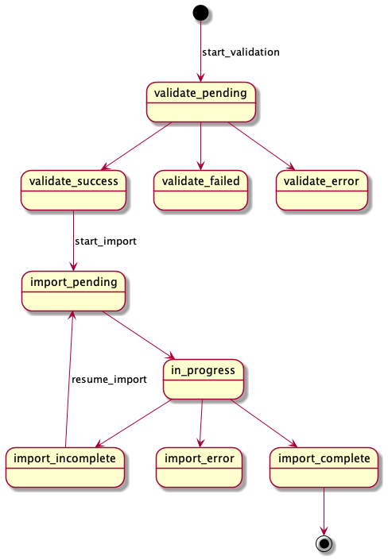

# Batch Import

## Introduction

Archelon can import data in batch using CSV files, via Plastron and STOMP
messaging.

## Import Process

The import process occurs in two stages:

* validate
* import

The "validate" stage uses Plastron to determine the syntactic validity of the
CSV metadata file. A file that has errors must be resubmitted with corrections
before it can be imported.

The "import" stage uses Plastron to perform the actual import. A syntactically
valid file may still fail, for example, if the related records specified in the
import cannot be found in Fedora, or the expected files are not found in the Zip
file associated with the import.

Loading sample data differs depending on whether Archelon running locally,
in a Docker container, or in Kubernetes.

Instructions for loading sample data is available in the
[umd-lib/umd-fcrepo][umd-fcrepo] repository:

* When running in Docker, see
  [docs/archelon-data-import-docker.md][archelon-data-import-docker]
* When running locally, see
  [docs/archelon-data-import-local.md][archelon-data-import-local]

## Import Workflow

The following diagram (derived from [import_workflow.txt](import_workflow.txt)
using [PlantUML](https://plantuml.com/) depicts the import workflow in detail:

[archelon-data-import-docker]: https://github.com/umd-lib/umd-fcrepo/blob/main/docs/archelon-data-import-docker.md
[archelon-data-import-local]: https://github.com/umd-lib/umd-fcrepo/blob/main/docs/archelon-data-import-local.md
[umd-fcrepo]: https://github.com/umd-lib/umd-fcrepo
